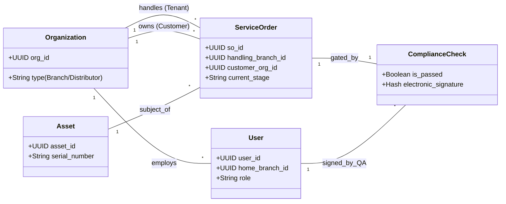

# Cognitive Enterprise Architecture for MedTech Service Operations

### A Hybrid Transactional/Analytical Processing (HTAP) Framework
**Author:** Mohamed Adnan Palli Konda  
**Status:** v1.0 (Research Blueprint)

  

## 📖 Overview
This repository hosts the architectural blueprint for transforming **High-Value Asset Management (MedTech)** operations from legacy spreadsheets to an AI-Native ecosystem.

It addresses the critical **"Spreadsheet Ceiling"** in service operations—where concurrency, regulatory compliance (ISO 13485 / 21 CFR Part 11), and real-time data visibility break down at scale.

## 🏗️ The Problem: The "Hidden Factory"
In many Service Hubs, operations rely on disjointed tools: Excel for logging, Smartsheet for tracking, and Email for approvals. This leads to:
* **Data Silos:** Finance (SAP) and Ops (Excel) data are disconnected, causing 24-48 hour reporting lags.
* **Compliance Risk:** Audit trails are scattered, making FDA/ISO audits laborious and error-prone.
* **Concurrency Issues:** Multiple technicians cannot update the same record simultaneously without version conflicts.

## 💡 The Solution: HTAP Architecture
The proposed framework utilizes a **Hybrid Transactional/Analytical Processing (HTAP)** approach to bridge the gap between strict operational governance and flexible analytics.

### Core Tech Stack:
* **Operational Layer (OLTP):** **PostgreSQL** (Managed) for strict ACID compliance, Row-Level Security, and relational integrity.
* **Integration Layer:** **Microsoft Fabric Mirroring** / CDC for near real-time data replication without complex ETL scripts.
* **Analytical Layer (OLAP):** **Microsoft Fabric OneLake** (Zero-Copy, Direct Lake Mode) for high-performance BI.
* **Intelligence Layer:** **Azure ML / Fabric Data Science** for predictive forecasting (e.g., Spare Parts Demand).

## 🧩 Domain-Driven Design (Schema)
The database is architected around **5 High-Cohesion Domains** to ensure scalability and regulatory compliance.

| Domain | Key Responsibility |
| :--- | :--- |
| **MASTER_DATA** | The "Golden Record" for Assets, Organizations (Internal Branches & External Distributors), and Users. |
| **SERVICE_OPS** | The workflow engine (Triage, Repair, QA) supporting **Multi-Actor Assignments** (Inspector, Technician, QA Manager). |
| **COMMERCIAL** | Managing the "Approval Ping-Pong" of Quotes (Versioned) and LPOs. |
| **LOGISTICS** | Batch processing for bulk shipments and double-entry inventory tracking. |
| **COMPLIANCE** | Immutable audit logs and **Electronic Signatures** (21 CFR Part 11). |

### Schema Visualization
*This diagram represents the logical flow between the core entities.*

📂 Repository Contents
/docs: The complete research framework and whitepaper (PDF), detailing the "As-Is" vs. "To-Be" states.

/schemas: MermaidJS source code for the full architecture and database entity diagrams.

🚀 Future Roadmap
The goal is to evolve this repository from a "Research Framework" to a "Reference Implementation."

[x] Phase 1: Publish Architecture & Domain Schema (Completed).

[ ] Phase 2: Release .sql DDL scripts for PostgreSQL (Tables, Triggers, RLS Policies).

[ ] Phase 3: Publish Python/PySpark notebooks for the Fabric "Silver Layer" transformation.

[ ] Phase 4: Develop a sample Power App template for the Technician Front-end.

🤝 Contribution & Feedback
This is an open blueprint designed to spark discussion on modernizing Service Operations. If you have suggestions on Unstructured Data handling in Fabric or MLOps pipelines, feel free to open an Issue or Pull Request.

Connect on LinkedIn: Mohamed Adnan Palli Konda : linkedin.com/in/adnan-pk
